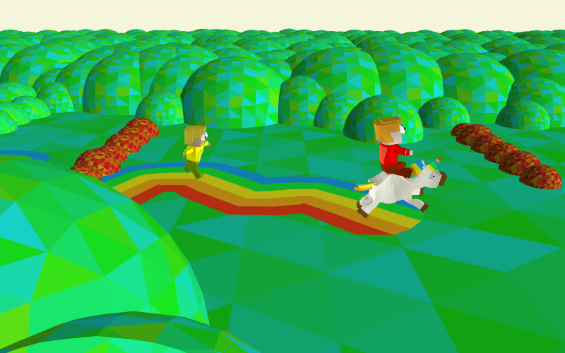

# Unicorn hunt



- [🦄 play](https://platane.github.io/unicorn-hunt)

- [🦄🦄🦄 multiplayer](https://wavedash.com/games/unicorn-hunt)

- [🏆 js13k game page](https://js13kgames.com/2026/games/unicorn-hunt)

> Race your friends through a whimsical forest. Catch a unicorn and ride it for a huge speed boost!
>
> Someone grabbed one first? Run on their rainbow trail to keep up.

# Usage

## Dev

```sh

# install
curl -fsSL https://wavedash.com/cli/install.sh | sh

# dev
bun dev

# dev + wavedash
wavedash dev
bun build ./index.html --outdir dist --watch

# push wavedash dev build
rm -r dist ; bun build index.html --outdir dist && wavedash build push

```

> for agent:
> wavedash skill: https://docs.wavedash.com/.well-known/skills/index.json
